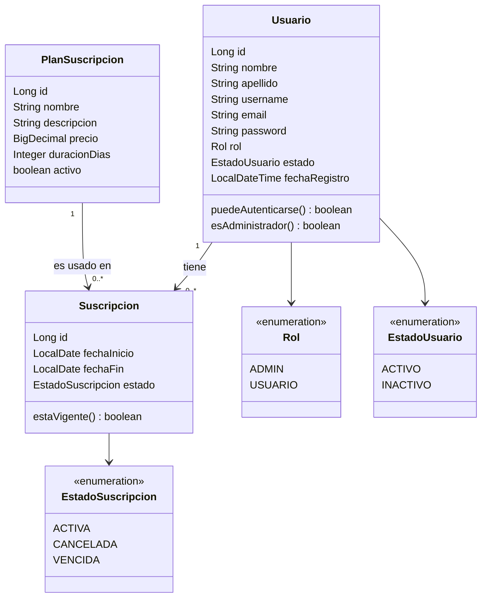

# PC Compare — Módulo de Gestión de Usuarios

Plataforma web para comparar componentes de PC (rendimiento, velocidad, precio, entre otras características). Este repositorio contiene la **codificación del módulo de Gestión de Usuarios**, responsable del registro, autenticación, administración de perfiles y del sistema de **suscripciones** de la plataforma.

> Módulo desarrollado como evidencia de codificación del ciclo de vida del software, a partir de los artefactos previos (diagrama de clases, casos de uso e historias de usuario) del proyecto.

## 1. Tecnologías y framework

| Capa | Tecnología |
|---|---|
| Lenguaje / plataforma | Java 21 |
| Framework | Spring Boot 3.3 (Spring Web, Spring Data JPA, Spring Security) |
| Autenticación | JSON Web Token (JJWT) |
| Base de datos | MySQL (perfil `mysql`) / H2 en memoria para desarrollo y pruebas (perfil `dev`, por defecto) |
| Build | Maven |
| Pruebas | JUnit 5 + Mockito + AssertJ |
| Control de versiones | Git |

## 2. Diagrama de clases del módulo



## 3. Arquitectura en capas

```
com.pccompare.gestionusuarios
├── config          -> SecurityConfig (seguridad, CORS)
├── controller       -> AuthController, UsuarioController, PlanSuscripcionController, SuscripcionController
├── dto
│   ├── request      -> datos de entrada validados (Bean Validation)
│   └── response      -> datos de salida (nunca exponen la contraseña)
├── exception         -> excepciones de negocio + GlobalExceptionHandler
├── model            -> entidades JPA (Usuario, PlanSuscripcion, Suscripcion) y enums
├── repository        -> interfaces Spring Data JPA
├── security          -> JwtUtil, JwtAuthFilter, CustomUserDetailsService, UsuarioAutenticadoProvider
├── service            -> interfaces de caso de uso
│   └── impl          -> implementación de las reglas de negocio
└── util              -> mappers entidad -> DTO
```

La arquitectura sigue una separación estricta de responsabilidades: **Controlador** (expone la API REST y valida la entrada) → **Servicio** (reglas de negocio y transacciones) → **Repositorio** (persistencia) → **Base de datos**. Los DTO evitan exponer las entidades JPA directamente y, en particular, blindan la contraseña del usuario.

## 4. Historias de usuario cubiertas

### Como administrador
| # | Historia de usuario | Endpoint |
|---|---|---|
| HU-A1 | Como administrador quiero listar todos los usuarios registrados para gestionar la plataforma | `GET /api/usuarios` |
| HU-A2 | Como administrador quiero consultar el detalle de un usuario | `GET /api/usuarios/{id}` |
| HU-A3 | Como administrador quiero asignar o cambiar el rol de un usuario | `PATCH /api/usuarios/{id}/rol` |
| HU-A4 | Como administrador quiero activar/desactivar la cuenta de un usuario | `PATCH /api/usuarios/{id}/estado` |
| HU-A5 | Como administrador quiero crear, editar y desactivar planes de suscripción | `POST /PUT /DELETE /api/planes` |
| HU-A6 | Como administrador quiero ver el estado de las suscripciones de todos los usuarios | `GET /api/suscripciones` |

### Como usuario
| # | Historia de usuario | Endpoint |
|---|---|---|
| HU-U1 | Como usuario quiero registrarme en la plataforma con mis datos personales | `POST /api/auth/registro` |
| HU-U2 | Como usuario quiero iniciar sesión con mi correo/usuario y contraseña | `POST /api/auth/login` |
| HU-U3 | Como usuario quiero consultar y actualizar mi perfil | `GET /PUT /api/usuarios/me` |
| HU-U4 | Como usuario quiero cambiar mi contraseña | `PUT /api/usuarios/me/password` |
| HU-U5 | Como usuario quiero ver los planes de suscripción disponibles | `GET /api/planes` |
| HU-U6 | Como usuario quiero suscribirme a un plan | `POST /api/suscripciones` |
| HU-U7 | Como usuario quiero consultar mi suscripción activa y mi historial | `GET /api/suscripciones/me/activa`, `GET /api/suscripciones/me` |
| HU-U8 | Como usuario quiero cancelar mi suscripción | `DELETE /api/suscripciones/{id}` |

## 5. Reglas de negocio, validaciones y restricciones

1. El **email** y el **username** de un usuario son únicos en toda la plataforma.
2. La contraseña debe tener mínimo 8 caracteres, con al menos una letra y un número, y se almacena siempre **cifrada con BCrypt** (nunca en texto plano ni se retorna en las respuestas de la API).
3. Todo usuario se registra por defecto con rol `USUARIO` y estado `ACTIVO`; solo un `ADMIN` puede cambiar el rol o el estado de otro usuario.
4. Un usuario **nunca se elimina físicamente**: un administrador solo puede desactivarlo (`estado = INACTIVO`), lo que le impide iniciar sesión (borrado lógico).
5. Solo los usuarios con estado `ACTIVO` pueden autenticarse; intentar iniciar sesión con una cuenta inactiva devuelve un error explícito.
6. Un usuario **no puede tener más de una suscripción `ACTIVA` al mismo tiempo**; debe cancelar la vigente antes de tomar una nueva.
7. Solo se puede suscribir a un plan que esté marcado como `activo`.
8. La fecha de fin de una suscripción se calcula automáticamente (`fechaInicio + duracionDias` del plan); el cliente nunca la envía.
9. Un usuario solo puede cancelar **sus propias** suscripciones; un plan que ya tiene suscripciones asociadas se desactiva en vez de eliminarse, para conservar el historial.
10. Los endpoints de administración (`/api/usuarios` salvo `/me`, gestión de planes, listado global de suscripciones) están protegidos y solo son accesibles con rol `ADMIN` (`@PreAuthorize("hasRole('ADMIN')")`).
11. Toda la API es *stateless*: la sesión se mantiene mediante un token JWT enviado en el header `Authorization: Bearer <token>`.

## 6. Estándares de codificación aplicados

- Nomenclatura en español para el dominio del negocio (clases, métodos, variables) y en inglés/estándar para los términos técnicos de Spring, de acuerdo con la convención Java (`camelCase` para métodos/variables, `PascalCase` para clases).
- Separación en capas (Controller / Service / Repository / DTO) y programación contra interfaces (`UsuarioService`, no `UsuarioServiceImpl`, en las dependencias).
- Uso de `@Transactional` para delimitar las operaciones de escritura y `@Transactional(readOnly = true)` en las consultas.
- Manejo centralizado de errores con `@RestControllerAdvice`, evitando bloques `try/catch` repetidos en los controladores.
- Validación declarativa con Bean Validation (`@NotBlank`, `@Email`, `@Pattern`, etc.) en los DTO de entrada.
- Comentarios Javadoc en clases y métodos que explican el propósito y las reglas de negocio aplicadas, no solo "qué hace" el código sino "por qué".
- DTO específicos de entrada/salida (nunca se expone la entidad JPA `Usuario` directamente en la API).

## 7. Cómo ejecutar el proyecto

### Requisitos
- Java 21
- Maven 3.9+ (o el wrapper `mvnw`, si se agrega)
- MySQL 8 (opcional; por defecto el proyecto usa H2 en memoria)

### Perfil de desarrollo (sin instalar nada, con H2)
```bash
mvn spring-boot:run
```
La aplicación queda disponible en `http://localhost:8080`, con la consola de H2 en `http://localhost:8080/h2-console` (JDBC URL: `jdbc:h2:mem:pccompare`, usuario `sa`, sin contraseña).

### Perfil conectado a tu base de datos MySQL
```bash
export DB_URL="jdbc:mysql://localhost:3306/pc_compare_db?useSSL=false&serverTimezone=UTC&createDatabaseIfNotExist=true"
export DB_USERNAME="tu_usuario"
export DB_PASSWORD="tu_password"
mvn spring-boot:run -Dspring-boot.run.profiles=mysql
```
Ajusta `DB_URL`, `DB_USERNAME` y `DB_PASSWORD` según la base de datos con la que ya vienes trabajando (ver `src/main/resources/application-mysql.yml`).

### Ejecutar las pruebas unitarias
```bash
mvn test
```

> **Nota sobre este entorno de generación:** el proyecto fue codificado y comprometido en Git en un entorno aislado sin acceso a Maven Central, por lo que **no fue posible ejecutar `mvn compile`/`mvn test` en este sandbox** para una verificación automática de compilación. El código fue revisado manualmente (firmas de interfaces vs. implementaciones, imports, anotaciones) para máxima confiabilidad, pero se recomienda ejecutar `mvn clean test` en tu máquina o IDE (IntelliJ/Eclipse/VS Code) como primer paso al recibir el proyecto.

## 8. Ejemplo rápido de uso de la API

```bash
# Registro
curl -X POST http://localhost:8080/api/auth/registro \
  -H "Content-Type: application/json" \
  -d '{"nombre":"Ana","apellido":"Pérez","username":"anaperez","email":"ana@example.com","password":"Password123"}'

# Login
curl -X POST http://localhost:8080/api/auth/login \
  -H "Content-Type: application/json" \
  -d '{"identificador":"ana@example.com","password":"Password123"}'

# Consultar mi perfil (usando el token recibido)
curl http://localhost:8080/api/usuarios/me -H "Authorization: Bearer <token>"
```

## 9. Control de versiones

El proyecto se versiona con **Git**, con commits incrementales por capa (andamiaje → modelo/persistencia → DTO/excepciones → seguridad → servicios → controladores → pruebas → documentación), de forma que el historial documenta la evolución del módulo. Se recomienda continuar el flujo de trabajo creando ramas por funcionalidad (`feature/...`) y confirmando con mensajes descriptivos siguiendo el mismo estilo usado en este historial.

## 10. Próximos pasos sugeridos

- Integrar este módulo con el resto de la plataforma (módulo de comparación de componentes).
- Agregar recuperación de contraseña por correo electrónico.
- Agregar integración con una pasarela de pagos real para las suscripciones Premium.
- Documentar la API con OpenAPI/Swagger (`springdoc-openapi`).
- Agregar pruebas de integración con `@WebMvcTest`/`@SpringBootTest` + `MockMvc` sobre los controladores.
